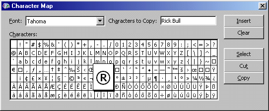



## Character Map V2

### Description

A character map like the windows one. This is an updated version of my previous attempt. It now uses only one picture box (instead of a load of labels) and does all the drawing via PaintPicture. It's a lot faster than my other one. Feel free to use this code in your own project (all you have to do is add the code for the insert button).
 
### More Info
 

             |
---                |---
**Submitted On**   |2002-06-22 16:10:58
**By**             |[Rick Bull](https://github.com/Planet-Source-Code/PSCIndex/blob/master/ByAuthor/rick-bull.md)
**Level**          |Intermediate
**User Rating**    |4.8 (24 globes from 5 users)
**Compatibility**  |VB 4\.0 \(32\-bit\), VB 5\.0, VB 6\.0
**Category**       |[Miscellaneous](https://github.com/Planet-Source-Code/PSCIndex/blob/master/ByCategory/miscellaneous__1-1.md)
**World**          |[Visual Basic](https://github.com/Planet-Source-Code/PSCIndex/blob/master/ByWorld/visual-basic.md)
**Archive File**   |[Character\_975806222002\.zip](https://github.com/Planet-Source-Code/rick-bull-character-map-v2__1-36149/archive/master.zip)

